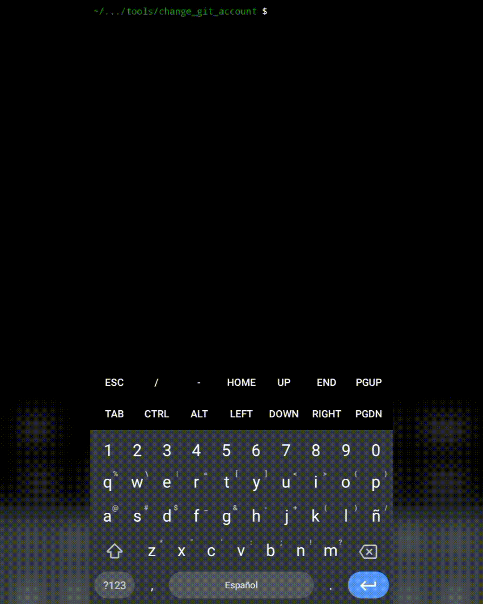

# Cambiar cuenta Git

Este proyecto permite moverse entre múltiples cuentas en Git.

Es bastante útil a pesar de su sencillez; es ideal para aquellos interesados en la simplicidad en las actividades diarias.

**Muestra de uso:**




## Clonar repositorio

Para clonar el repositorio, ejecute la siguiente instrucción:

```bash
git clone https://github.com/atlazwhite/chga.git
```

## Instalación

Para instalar el proyecto, ejecute las siguientes instrucciones:

```bash
chmod u+x /path/to/chga/index.py
sudo ln -s /path/to/chga/index.py /bin/chga
```

## Desinstalación

Para desinstalar el proyecto, ejecute las siguientes instrucciones:

```bash
sudo rm /bin/chga
rm -rf /path/to/chga/
```

## Añadir usuarios

Para añadir un usuario, primero cree el directorio `users`.

```bash
mkdir /path/to/chga/users/
```

El directorio `users` es la ubicación donde almacenaremos la configuración de usuario de Git de cada usuario.

> [!IMPORTANT] Observación
> **Existen dos formas de añadir usuarios:** Es importante tener en cuenta que puede usar cualquiera, en el momento en que lo desee.

### Manualmente

Si elige este método, recuerde que debe escribir la configuración de usuario de Git usted mismo, cada vez que desee añadir un usuario a este proyecto.

```bash
# Use el editor de su preferencia (nvim, nano, etc.)
nvim /path/to/chga/users/[username]
# Ejemplo:
# nvim /path/to/chga/users/john-doe
```

*Ejecute, escriba la configuración, guarde y salga*

**A continuación un ejemplo:**

Dentro del fichero `/path/to/chga/users/john-doe` escriba su configuración de usuario de Git.

```
[user]
        name = John_Doe
        email = johndoe@domain.net
[init]
        defaultBranch = master
```

*Guarde y salga.*

### Pre-existente

Como el título indica, este método lo debe aplicar para ficheros de configuración de usuario de Git preexistentes; por lo tanto, es más directo.

1. Localice su fichero de configuración de usuario de Git.
2. Copie el fichero de configuración de usuario al directorio `users` de este proyecto.
3. Renombre el fichero con el nombre de usuario del propietario de dicho fichero de configuración.

Puede hacer esto con todos los ficheros de configuración de usuario de Git que desee añadir a este proyecto.

```bash
cp .gitconfig /path/to/chga/users/[username]
# Ejemplo:
# cp .gitconfig /path/to/chga/users/john-doe
```

*Ejecute y listo.*

## Eliminar usuarios

Para eliminar un usuario, primero debe saber algo.

No, al eliminar el fichero de configuración de usuario del directorio `users` de este proyecto, no genera problema alguno.

Una vez que sabe esto, ejecute la siguiente instrucción:

```bash
rm /path/to/chga/users/[username]
# Ejemplo:
# rm /path/to/chga/users/john-doe
```

*Ejecute y listo.*
